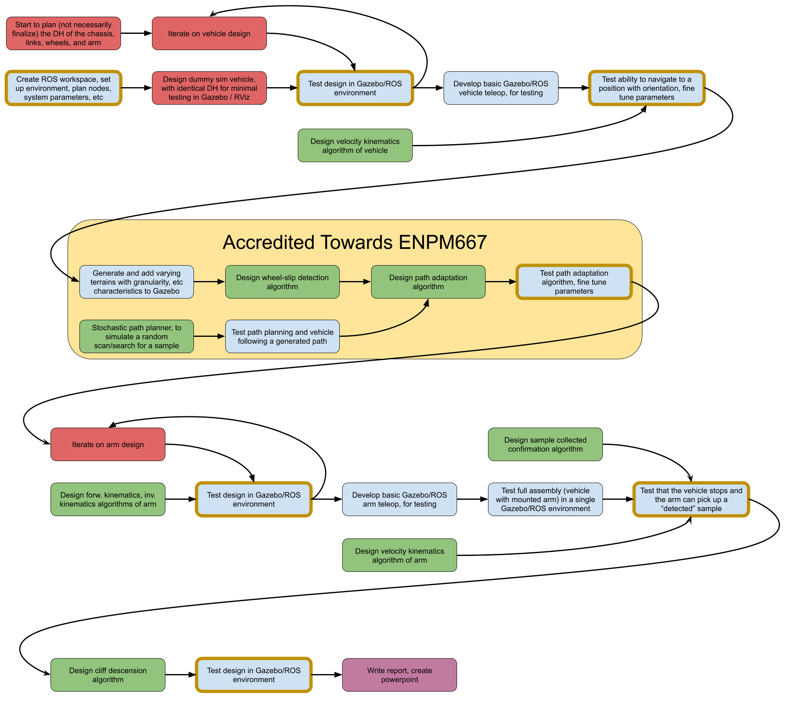

# srr_ws (Sample-Return Rover ROS workspace)

The Sample-Return Rover (SRR) is an extraterrestrial vehicle designed,
and over the years evolved, at NASA’s Jet Propulsion Laboratory. Its
design became necessary as interplanetary travel and exploration became
a more reasonable and exciting endeavor for NASA. The first design of
the SRR was finished in 1997 in an attempt to establish a foundation as
to what it would take to for the robot(s) to safely traverse, interact
with, and survive in a harsh Martian environment. This repo is an
attempt to model and simulate an extraterrestrial vehicle inspired by
an early iteration of the SRR, complete with the vehicle’s foundation
and the onboard serial kinematic chain used for sample collection.

Running the sim for either the SRR, SRA (Sample-Return Arm), or the SRA
mounted onto the SRR, run the following command:

```
roslaunch srr_sim main.launch model:=XXX
```

Where XXX is one of 'srr', 'sra', or 'combined' accordingly.

Anticipated phases of development:

